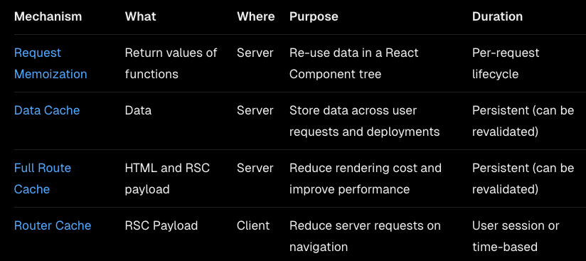

## Server Action
```shell
curl 'http://localhost:3001/gon' \
-H 'Accept: text/x-component' \
-H 'Accept-Language: en-US,en' \
-H 'Connection: keep-alive' \
-H 'Content-Type: multipart/form-data; boundary=----WebKitFormBoundaryRbMGrgTgQLSiadBX' \
-H 'Cookie: PGADMIN_LANGUAGE=ko' \
-H 'Next-Action: 40ef94b0a42c5dafda3d40f6133107df3f8ade2db5' \
-H 'Next-Router-State-Tree: %5B%22%22%2C%7B%22children%22%3A%5B%22gon%22%2C%7B%22children%22%3A%5B%22__PAGE__%22%2C%7B%7D%2C%22%2Fgon%22%2C%22refresh%22%5D%7D%5D%7D%2Cnull%2Cnull%2Ctrue%5D' \
-H 'Origin: http://localhost:3001' \
-H 'Referer: http://localhost:3001/gon' \
-H 'Sec-Fetch-Dest: empty' \
-H 'Sec-Fetch-Mode: cors' \
-H 'Sec-Fetch-Site: same-origin' \
-H 'Sec-GPC: 1' \
-H 'User-Agent: Mozilla/5.0 (Linux; Android 6.0; Nexus 5 Build/MRA58N) AppleWebKit/537.36 (KHTML, like Gecko) Chrome/132.0.0.0 Mobile Safari/537.36' \
-H 'sec-ch-ua: "Not A(Brand";v="8", "Chromium";v="132", "Brave";v="132"' \
-H 'sec-ch-ua-mobile: ?1' \
-H 'sec-ch-ua-platform: "Android"' \
--data-raw $'------WebKitFormBoundaryRbMGrgTgQLSiadBX\r\nContent-Disposition: form-data; name="1_$ACTION_ID_40ef94b0a42c5dafda3d40f6133107df3f8ade2db5"\r\n\r\n\r\n------WebKitFormBoundaryRbMGrgTgQLSiadBX\r\nContent-Disposition: form-data; name="1_title"\r\n\r\naa\r\n------WebKitFormBoundaryRbMGrgTgQLSiadBX\r\nContent-Disposition: form-data; name="1_content"\r\n\r\nbbbb\r\n------WebKitFormBoundaryRbMGrgTgQLSiadBX\r\nContent-Disposition: form-data; name="0"\r\n\r\n["$K1"]\r\n------WebKitFormBoundaryRbMGrgTgQLSiadBX--\r\n'
```
- 지가 알아서 implicit하게 router를 만들고 요청을 보내는 형태
- Secure하지 않으므로 주의

## layout.tsx
- 중첩이된다
- {[]}
  - [] : layout
  - {} rootLayout

## Caching ([Link](https://nextjs.org/docs/app/building-your-application/caching))
- 